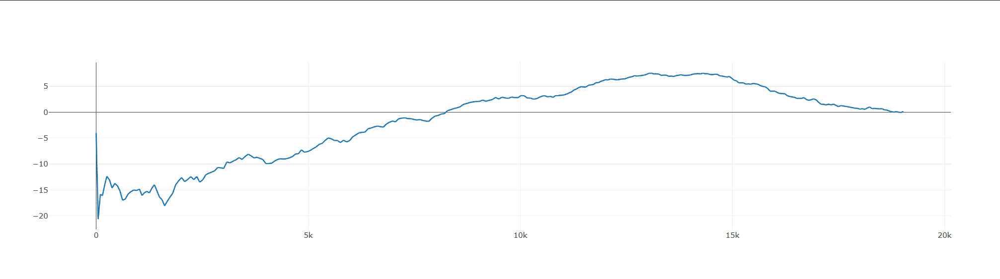

# 🃏 MLOps Pipeline: Deep Q-Network Agent for Texas Hold'em


This project implements an end-to-end MLOps pipeline for training, tracking, and serving a Deep Q-Network (DQN) agent capable of playing Heads-Up No-Limit Texas Hold’em. 

Rather than solely focusing on the Reinforcement Learning mathematics, this repository emphasizes industry-standard systems engineering. The project utilizes **Docker** for containerization, **MLflow** for experiment tracking, and **FastAPI** for real-time model serving, completely decoupling the training environment from the production API.

## 🏗️ Architecture & Infrastructure

* **Continuous Integration & Deployment (GitHub Actions):** Automated CI/CD pipelines enforce code quality (via Flake8) and automatically build/push production-ready Docker images on every commit to the main branch.
* **Experiment Tracking (MLflow & PostgreSQL):** All training runs, hyperparameter tuning, and opponent-specific evaluations are logged to a local MLflow tracking server backed by a PostgreSQL database.
* **Model Serving (FastAPI):** Trained PyTorch `.pth` weights are loaded into a REST API, allowing client applications to request inference (game actions) via JSON payloads without requiring local PyTorch installations.
* **Containerization (Docker Compose):** The entire system—database, tracking server, and inference API—is containerized and orchestrated via Docker Compose for complete local reproducibility.

## 🗂️ Project Structure

```text
├── .github/workflows/   # CI/CD automation pipelines
├── agent/               # DQN model architecture, replay buffer, and logic
├── api/                 # FastAPI application, routing, and schemas
├── engine/              # Texas Hold'em game mechanics and baseline bots
├── scripts/             # Training and evaluation orchestration
├── docker-compose.yml   # Multi-container orchestration
├── Dockerfile           # Environment definition for the API
└── requirements.txt     # Dependency management
```

## 🛠️ Tech Stack
* **Deployment & Tracking:** Docker, Docker Compose, MLflow, PostgreSQL, GitHub Actions
* **API & Backend:** Python 3.12, FastAPI, Uvicorn
* **Machine Learning:** PyTorch (DQN), Reinforcement Learning, Curriculum Learning

---

## 📊 Model Analysis & Training Dynamics

Training a reinforcement learning agent in a high-variance environment with imperfect information (Texas Hold'em) presents unique challenges. The v0 bot was trained for about 1.5 million hands against rule based bots the rule based bots: *Station* (Passive/Loose), *Police* (Tight/ABC).  The v1 model is in development, training against a curriculum of four distinct rule-based baseline bots: *Station* (Passive/Loose), *Police* (Tight/ABC), *Pressure* (Aggressive), and *Punisher* (Hyper-Aggressive).


(Note: The above graph is a smoothed moving average of the winrate (in BB/100) against the tight/ABC bot across 300k hands during the training of v1. Metrics are logged to MLflow every 10,000 hands, and the graph is generated from the MLflow dashboard.)
**Key MLflow Insights:**
1. **The Exploitation Plateau:** By episode 150,000, the model successfully escaped the negative-profit exploration phase. It learned to highly exploit passive opponents, achieving a winrate of **+70.20 BB/100** against the tight/ABC bot by aggressively stealing blinds and capitalizing on folds.
2. **Catastrophic Forgetting & Policy Churn:** Smoothed MLflow metrics revealed training instability around episode 200,000. As the exploration rate (`epsilon`) floored at 5%, the network began over-fitting to whichever specific bot it was currently facing in the evaluation loop. This caused it to overwrite generalized weights, resulting in policy churn. 
3. **Future Iterations:** To mitigate catastrophic forgetting in v2, the architecture will be updated to include a larger Replay Buffer and Prioritized Experience Replay (PER) to ensure the network continuously trains on older, diverse game states.

---

## 🚀 How to Run (Local Deployment)

To spin up the entire infrastructure locally, ensure Docker is installed on your machine and run:

```bash
docker-compose up --build
```
This command provisions the network and launches three containers:
1. `poker_db`: PostgreSQL database for tracking metadata.
2. `poker_mlflow`: MLflow server (accessible at `http://localhost:5000`).
3. `poker_api`: FastAPI model serving endpoint (accessible at `http://localhost:8000`).

### Pinging the Inference API
Once the containers are running, you can request an action from the production bot by sending a game state vector to the API.

**For Mac/Linux (curl):**
```bash
curl -X 'POST' \
  'http://localhost:8000/get_action' \
  -H 'Content-Type: application/json' \
  -d '{
  "state_vector": [0.0, 0.0, 0.0, 0.0, 0.0, 0.0, 0.0, 0.0, 0.0, 0.0, 0.0, 0.0, 0.0, 0.0, 0.0, 0.0, 0.0, 0.0, 0.0, 0.0, 0.0, 0.0, 0.0, 0.0, 0.0, 0.0, 0.0, 0.0, 0.0, 0.0, 0.0, 0.0, 0.0, 0.0, 0.0, 0.0, 0.0, 0.0, 0.0, 0.0, 0.0, 0.0, 0.0, 0.0],
  "valid_actions": [1, 1, 1, 0, 0, 0, 0]
}'
```

**For Windows (PowerShell):**
```powershell
Invoke-RestMethod -Uri "http://localhost:8000/get_action" `
  -Method Post `
  -Headers @{ "Content-Type" = "application/json" } `
  -Body '{"state_vector": [0.0, 0.0, 0.0, 0.0, 0.0, 0.0, 0.0, 0.0, 0.0, 0.0, 0.0, 0.0, 0.0, 0.0, 0.0, 0.0, 0.0, 0.0, 0.0, 0.0, 0.0, 0.0, 0.0, 0.0, 0.0, 0.0, 0.0, 0.0, 0.0, 0.0, 0.0, 0.0, 0.0, 0.0, 0.0, 0.0, 0.0, 0.0, 0.0, 0.0, 0.0, 0.0, 0.0, 0.0], "valid_actions": [1, 1, 1, 0, 0, 0, 0]}'
```

---


Architecture:

| Component      | Value                    |      |         |         |        |
|----------------|--------------------------|------|---------|---------|--------|
| Input Size     | 44                       |      |         |         |        |
| Hidden Layers  | 2                        |      |         |         |        |
| Hidden Units   | 128                      |      |         |         |        |
| Activation     | ReLU                     |      |         |         |        |
| Output         | Discrete masked Q-values |      |         |         |        |
| Target Network | Yes                      |      |         |         |        |
| Replay Buffer  | Yes                      |      |         |         |        |
| Actions: Fold  | Check                    | Call | 1/2 Pot | 3/4 Pot | All-In |


🎯 Design Philosophy

Instead of training exclusively via self-play, this project emphasizes:

1. Exploitative Learning

The agent is optimized to beat novice-style players rather than converge to equilibrium.

2. Curriculum Learning

Opponents are introduced in stages to shape specific behavioral traits.

3. Adversarial Opponent Design

Bots are intentionally constructed to expose weaknesses such as:

Over-aggression

Spew bluffs

Blind continuation betting

*Authored by Daniel Scott Johnson | Computer Science @ California State University, Long Beach*
