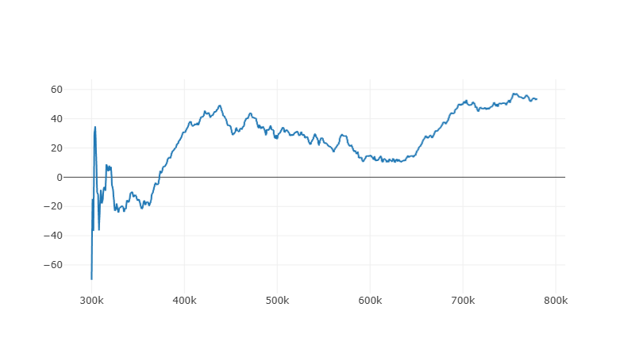
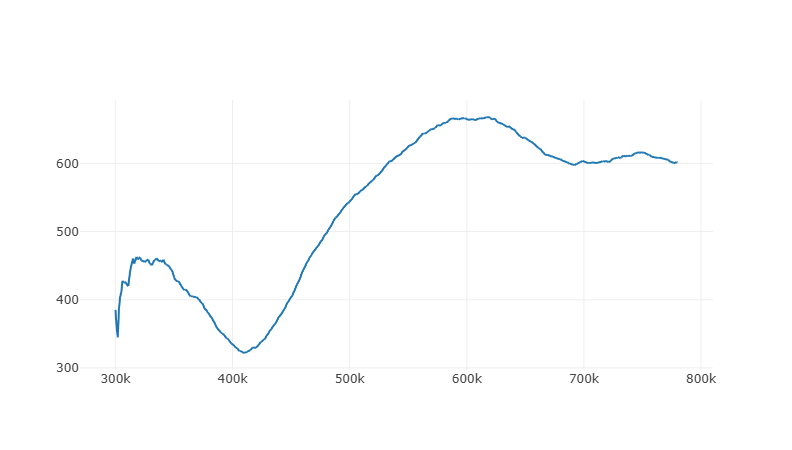
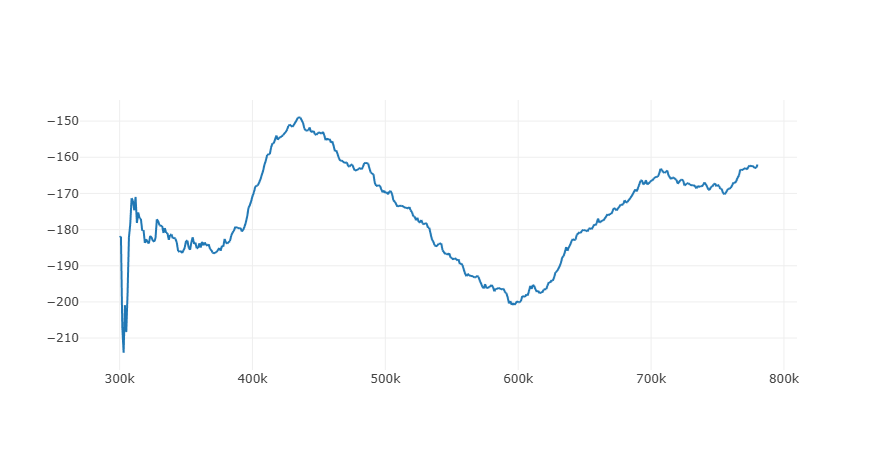
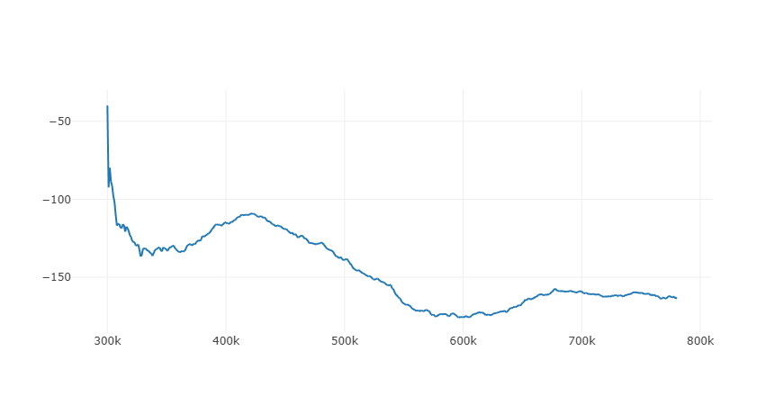

# 🃏 MLOps Pipeline: Deep Q-Network Agent for Texas Hold'em


🎮 **Play the Live Game:** [poker-5vsg.onrender.com](https://poker-5vsg.onrender.com)

This project implements an end-to-end MLOps pipeline for training, tracking, and serving a Deep Q-Network (DQN) agent capable of playing Heads-Up No-Limit Texas Hold’em. 

Built with an **AI Platform Engineering** mindset, this repository emphasizes industry-standard systems architecture over isolated algorithmic experiments. The environment utilizes **Docker** for containerization, **MLflow** with a PostgreSQL backend for experiment tracking, **GitHub Actions** for CI/CD, and **FastAPI** for real-time model serving on **AWS EC2**. This architecture completely decouples the PyTorch training environment from the highly available production API.

## 🏗️ Architecture & Infrastructure

* **Cloud Deployment (AWS EC2):** The production environment is hosted on an Amazon EC2 instance, providing a scalable compute environment for the containerized stack. Traffic is routed to the inference API, allowing remote clients to request real-time poker actions.
* **Continuous Integration & Deployment (GitHub Actions):** Automated CI/CD pipelines enforce code quality via Flake8 and seamlessly build/push production-ready Docker images on every commit to the main branch.
* **Containerization (Docker Compose):** The entire application lifecycle is containerized. A single `docker-compose.yml` orchestrates the PostgreSQL database (`poker_db`), the MLflow server (`poker_mlflow`), and the FastAPI backend (`poker_api`) for guaranteed parity between local and EC2 environments.
* **Dynamic Model Serving (FastAPI):** The REST API is built on Python 3.12 and Uvicorn. Upon startup, the API's lifespan context manager automatically scans the volume for the highest version `.pth` model and dynamically loads the latest PyTorch weights into memory without requiring manual code updates. 
* **Experiment Tracking (MLflow & PostgreSQL):** Hyperparameter tuning, loss metrics, and opponent-specific win rates are logged to an MLflow tracking server backed by a persistent PostgreSQL database.

---

## 📊 Model Analysis: Distribution Shift & The Exploitation Trap

Training a reinforcement learning agent in a high-variance environment with imperfect information presents unique challenges. In the v1 training loop, the bot was evaluated across 780,000 episodes using an asymmetric, exploitative curriculum distribution:
* **Station** (Loose-Passive): 40%
* **Police** (Tight-Passive): 20%
* **Pressure** (Loose-Aggressive): 20%
* **Punisher** (Tight-Aggressive): 20%

(VS. Station BB/100)



(VS. Police BB/100)




**1. The Exploitation Plateau (Successes)**
During the initial phases, the model successfully escaped the negative-profit exploration phase. By capitalizing on the fact that 60% of its opponents were passive, the agent learned highly exploitative strategies (e.g., relentless value betting and stealing blinds), achieving massive win rates against the `Station` and `Police` bots.

(VS. Pressure BB/100)


(VS. Punisher BB/100)



**2. Catastrophic Forgetting & Replay Buffer Saturation**
As the profits against passive bots soared, performance against the aggressive `Pressure` and `Punisher` bots collapsed. By hardcoding the opponent distribution to 60% passive, the Replay Buffer became saturated with passive game states (e.g., limps and check-downs). The exact strategy that crushed the passive bots (value betting light) was mathematically disastrous against aggressive bots that frequently check-raise all-in. Because the aggressive states were rarely sampled in the PyTorch mini-batches, the network's weights were overwritten by the passive-bot updates. The model literally "forgot" how to navigate aggression.

### 🛠️ Architectural Fixes for v2
To stabilize win rates across all opponent types and ensure the bot generalizes without catastrophic forgetting, the v2 pipeline will implement the following MLOps and RL architecture upgrades:
* **Dynamic Curriculum Sampling:** Instead of a static 40/20/20/20 split, the training loop will dynamically sample opponents inversely proportional to the bot's current win rate against them, forcing the network to continuously train against its biggest weaknesses.
* **Segregated Replay Buffers:** Maintaining separate replay buffers for each opponent type and forcing the PyTorch data loader to pull an equal number of samples from *each* buffer during every mini-batch update to prevent policy overwrite.
* **Prioritized Experience Replay (PER):** Ensuring the network samples experiences with the highest Temporal Difference (TD) error (e.g., hands lost to the `Punisher` bot) rather than uniformly sampling the easily beaten `Station` bot.

---

### 🚀 Completed Upgrades (v2-Baseline)
We have successfully implemented the core engineering and algorithmic baseline upgrades for the v2 pipeline:
* **GPU-Native Replay Buffer:** Replaced the CPU-based `deque` memory with a pre-allocated PyTorch Tensor Replay Buffer directly in GPU VRAM (reducing training times by ~40%).
* **Double Dueling DQN (D3QN):** Upgraded the network to a Dueling architecture (splitting state-value and action-advantage streams) and refactored the Bellman update to use Double DQN target evaluation to eliminate Q-value overestimation bias.
* **Game Engine O(1) Optimization:** Converted the state generation (`get_state`) and showdown logic in `engine/game.py` from linear O(N) list searches (`.index()`) to O(1) dictionary lookups, eliminating simulation latency bottlenecks.
* **Metrics Tracker Fixes:** Corrected the metrics tracker to properly reset statistics between evaluation phases to capture clean moving average win rates.

---

## 🚀 Deployment & Usage

### Spinning up the Stack
Whether deploying locally or on your EC2 instance, the infrastructure is provisioned with a single command:

```bash
docker-compose up --build -d
```
This launches three interconnected containers:

poker_db: PostgreSQL database for tracking metadata on port 5432.

poker_mlflow: MLflow server on port 5000.

poker_api: FastAPI model serving endpoint on port 8000.

### Live Web Game
The Texas Hold'em web application and game engine is fully deployed and playable at:
👉 **[poker-5vsg.onrender.com](https://poker-5vsg.onrender.com)**

### Interacting with the RESTful API
To request an inference action from the bot directly, send a state vector and a valid actions mask as a JSON payload to the `/get_action` endpoint on the deployed AWS EC2 bot instance.

Example Inference Request:
```bash
curl -X 'POST' \
  'http://3.18.106.156:8000/get_action' \
  -H 'Content-Type: application/json' \
  -d '{
  "state_vector": [0.0, 0.0, 0.0, 0.0, 0.0, 0.0, 0.0, 0.0, 0.0, 0.0, 0.0, 0.0, 0.0, 0.0, 0.0, 0.0, 0.0, 0.0, 0.0, 0.0, 0.0, 0.0, 0.0, 0.0, 0.0, 0.0, 0.0, 0.0, 0.0, 0.0, 0.0, 0.0, 0.0, 0.0, 0.0, 0.0, 0.0, 0.0, 0.0, 0.0, 0.0, 0.0, 0.0, 0.0],
  "valid_actions": [1, 1, 1, 0, 0, 0, 0]
}'
```
Expected JSON Response:
```json
{
  "bot_action": "Check",
  "action_index": 1
}
```

### Model Architecture

| Component      | Value                                                        |
|----------------|--------------------------------------------------------------|
| Input Size     | 44                                                           |
| Architecture   | Double Dueling DQN (D3QN)                                    |
| Hidden Layers  | 2 Shared Feature Layers, 2 Value, 2 Advantage                |
| Hidden Units   | 512 (Shared) / 256 (Streams)                                 |
| Activation     | Leaky ReLU                                                   |
| Output         | 7 Discrete masked Q-values                                   |
| Replay Buffer  | GPU Pre-allocated Tensor Replay Buffer                       |
| Target Network | Yes (Periodic soft updates)                                  |
| Actions        | Fold, Check, Call, Min Raise, Med Raise, Max Raise, All-In   |

🎯 Design Philosophy

Instead of training exclusively via self-play to converge on a GTO (Game Theory Optimal) equilibrium, this system is heavily geared toward Exploitative Learning and Curriculum Learning to expose specific opponent weaknesses (e.g., over-aggression, spew bluffs, blind continuation betting).

*Authored by Daniel Scott Johnson | Computer Science @ California State University, Long Beach*
